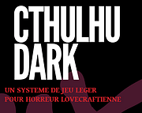

# Cthulhu Dark

Une traduction fidèle du jeu de Graham Walmsley. Un système de jeu hyper simple pour jouer sans préparation à des aventures dans le Mythe de Cthulhu.

Attention: la folie vous guette.

Le PDF est dans le folder "_release" ou sur Itch.

Voir aussi la page html : https://orey.github.io/cthulhu-dark-fr

<table>
<tr><td></td>
<td><b>Cthulhu Dark JDR en français</b> 
by <a href="https://rouboudou.itch.io">rouboudou</a> 
Cthulhu Dark, le jeu de rôles en français 
 
</td></tr>
</table>

